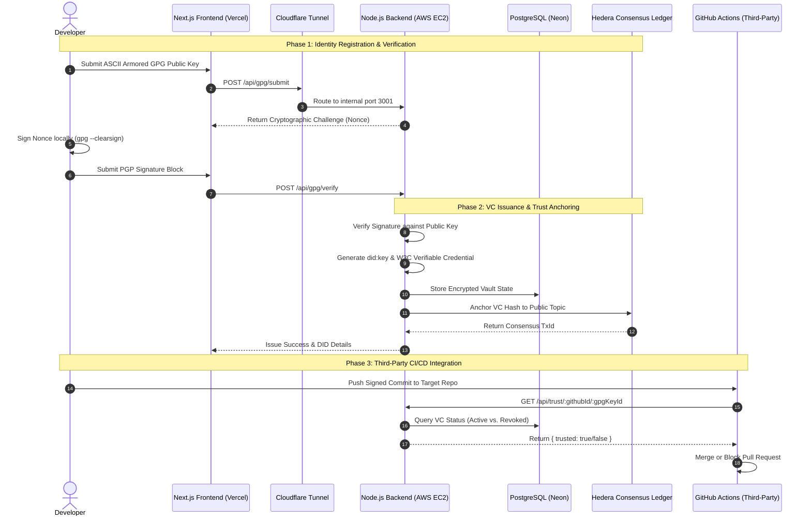

<div align="center">

  <h1>🛡️ GitShield: Decentralized Identity Gateway</h1>
  <p>
    <strong>Cryptographically bind your GitHub profile to a public GPG key using W3C Verifiable Credentials anchored to the Hedera Blockchain.</strong>
  </p>

  <p>
    
    
    
    
    
    
  </p>
</div>

---

## 🚨 The Problem

In the opensource ecosystem, verifying the true identity of a contributor is notoriously difficult. While developers can sign commits with GPG keys, maintaining the lifecycle of those keys and mathematically proving that a specific GitHub account owns a specific private key relies on fragmented, centralized trust models. If a developer's machine is compromised, there is no standardized, immutable way to instantly alert third party repositories to reject incoming code.

## 💡 How GitShield Solves It

GitShield acts as a **Decentralized Verification Gateway**. It forces developers to mathematically prove ownership of their keys via terminal signing. Once verified, GitShield issues a standard W3C Verifiable Credential (VC) mapping their GitHub ID to a Decentralized Identifier (DID) and anchors that proof immutably to the Hedera Consensus Service.

Third party CI/CD pipelines can then ping the GitShield API to instantly verify if an incoming commit is signed by a trusted, non revoked identity.

---

#### DEMO: https://gitshield-web.vercel.app/


---

## 🏗️ System Architecture

GitShield utilizes a modern edge-to-cloud architecture, leveraging Cloudflare Tunnels for secure ingress to an AWS-hosted Node.js backend, with data anchored to the Hedera testnet.



---

## ✨ Core Features

* **Zero-Knowledge Proof of Ownership:** Users must cryptographically sign a backend-generated nonce using their local GPG engine to prove ownership of the private key.
* **W3C Verifiable Credentials:** Generates standard-compliant `did-jwt-vc` credentials binding GitHub IDs to Decentralized Identifiers (DIDs).
* **Hedera Trust Anchor:** All credential hashes (and revocation states) are logged to the Hedera Consensus Service (HCS), providing immutable, decentralized proof of issuance.
* **Encrypted Identity Vault:** Credentials are encrypted at rest using `AES-256-CBC` symmetric encryption before database storage.
* **The Web3 "Kill Switch":** A 1-click revocation feature that permanently burns the credential on the Hedera ledger, instantly notifying third-party gateways that the identity is compromised.

---

## 📸 Gallery


<strong>1. Unauthenticated Landing Page</strong>


<strong>2. Cryptographic Challenge Flow</strong>


<strong>3. The Decentralized Wallet Dashboard</strong>


---

## 🚀 Tech Stack & Infrastructure

### Application Layer
* **Frontend:** Next.js 14 (App Router), React, Tailwind CSS v4 (Oxide), NextAuth.js.
* **Backend:** Node.js, Express, TypeScript.
* **Cryptography:** `openpgp` (Key Parsing/Verification), `did-jwt-vc` (W3C Standard Issuance), `crypto` (AES-256 Vault Encryption).

### Infrastructure & DevOps
* **Database:** Serverless PostgreSQL via Neon Tech.
* **ORM:** Prisma Client with `@prisma/adapter-pg`.
* **Blockchain Integration:** Hedera Hashgraph JavaScript SDK (`@hashgraph/sdk`).
* **Server Hosting:** Amazon Web Services (AWS) EC2 Ubuntu Instance.
* **Process Management:** PM2 (Daemonizing the Node.js API).
* **Ingress & Routing:** Cloudflare Tunnels (`cloudflared`) bypassing AWS mixed-content blocks for secure HTTPS routing.

---

## 🔌 API Reference for CI/CD

GitShield is designed to be consumed by third-party services. To protect your repository, you can add a simple `curl` check to your GitHub Actions pipeline:

**Endpoint:** `GET /api/trust/:githubId/:gpgKeyId`

**Success Response (Identity Valid & Active):**
```json
{
  "trusted": true,
  "identity": {
    "githubId": "112415343",
    "username": "DevName",
    "did": "did:key:z..."
  },
  "proof": {
    "vcHash": "57a7344...",
    "hederaTopicId": "0.0.8606284",
    "explorerUrl": "[https://hashscan.io/testnet/topic/0.0.8606284](https://hashscan.io/testnet/topic/0.0.8606284)"
  }
}
```

**Failure Response (Compromised or Missing):**
```json
{
  "trusted": false,
  "reason": "Identity credential has been revoked or is missing."
}
```

---

## 💻 Local Development Setup

To run GitShield locally, you need Node.js 20+ and a PostgreSQL database connection string.

**1. Clone the repository:**
```bash
git clone [https://github.com/YOUR_GITHUB_USERNAME/gitshield.git](https://github.com/YOUR_GITHUB_USERNAME/gitshield.git)
cd gitshield
```

**2. Install dependencies:**
```bash
npm install
```

**3. Configure Environment Variables:**
Create a `.env` file in `apps/web` and `apps/backend`. Reference `.env.example` for required keys (GitHub OAuth, Neon DB URL, Hedera Testnet Account).

**4. Initialize the Database:**
```bash
cd apps/backend
npx prisma generate
npx prisma db push
```

**5. Start the Monorepo:**
```bash
# In the root directory
npm run dev
```
* Frontend: `http://localhost:3000`
* Backend API: `http://localhost:3001`
---
